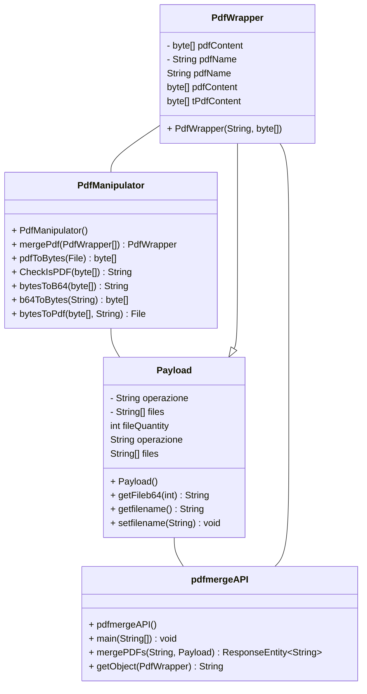

# pdf_merge_API
Un API per il merge di più pdf in uno + creazione di un custom connector per l'implementazione in un workflow su  Windows Power Automate 


## Prerequisiti

- JDK 17.0.2 o superiore
- Apache Maven 3.9.1
- Connessione Internet


## Configurazione

1. Clonare il repository
git clone https://github.com/NOME_DEL_REPO.git
2. Eseguire il comando Maven per compilare ed eseguire l'applicazione
mvn spring-boot:run
3. L'applicazione sarà disponibile all'indirizzo `http://localhost:20801`


## API

### Endpoint

POST api/pdf/merge
attualmente è presente solo un endpoint per l'operazione di merging tra 2 o più pdf

### Richiesta

La richiesta deve contenere l'api-key nell'header, e il json deve contenere almeno 2 file pdf in formato base64 e il nome da dare al pdf in output.<br />
I formati pdf accettati vanno da versione 1.0 a 1.7 .<br />
Se la richiesta non dovesse essere conforme, il response conterrà una stringa con il tipo di errore oltre all' HTTP status.<br />

### Header della richiesta

```header
API_KEY: <api_key>
```

Momentanemente ho optato per una api-key costante.<br />
api_key = "ABC123".<br />

la label: API_KEY.<br />
la variabile: api_key_receiver.<br />


### Parametri della richiesta

| Nome  | Tipo | Descrizione |
| ------------- | ------------- | ------------- |
| `files`  | `String[]`  | Array di stringhe Base64 che rappresentano i PDF da unire |
| `pdfname`  | `String`  | Nome del file di output |

### Esempio di richiesta

```json
{
"filename": "pdfexample",
"files": [
            "File1": "JVBERi0xLjUKJcOkw7zDtsOfCjIgMCBv….",
            "File2": "JVBERi0xLjUKJcOkw7zDtsOfCjIgMCBv….",
            "FileN": "JVBERi0xLjUKJcOkw7zDtsOfCjIgMCBv…."
           ]
}
```

### Risposta

Se la richiesta ha successo, l'API restituirà il file PDF unito in formato base64 e il nome del pdf con estensione (utile in un workflow)\

### Parametri della risposta

| Nome  | Tipo | Descrizione |
| ------------- | ------------- | ------------- |
| `PdfContent`  | `String`  | Stringa base 64 del pdf risultante |
| `PdfName`  | `String`  | Nome del file di output |

### Esempio di risposta 

risposta andata a buon fine:
```json
{
    "PdfContent": "JVBERi0xLjQKJfbk/N8KMSAwIG9iago8PAovVH..",
    "PdfName":"pdfexample.pdf"
}
```

risposte di errore:
- Api-key scorretta o non presente
- quantità di file insufficente
- file invalido
- internal server error generico durante il merging

## UML class diagram


## Dipendenze

- Spring Boot:  per configurare un endpoint e l'api
- Apache PDFBox: libreria per effettuare operazioni sui pdf
- commons-io: libreria per facilitare le conversioni tra formati di files

## Licenza

Questo progetto è distribuito con la licenza MIT. Consultare il file LICENSE per ulteriori informazioni.
