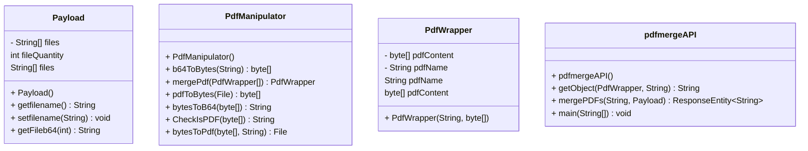

# pdf_merge_API

Il programma consente agli utenti di unire più file PDF in un unico documento tramite un API + creazione di un custom connector per l'implementazione in un workflow su  Windows Power Automate 


## Prerequisiti

- JDK 17.0.2 o superiore
- Apache Maven 3.9.1
- Connessione Internet

## Installazione

Per installare PDFMerge, scarica l'ultima [Release](https://github.com/Coco01010/perera-pdf-merger/releases/tag/pdf) del file JAR dell'applicazione. \
Oppure eseguire il comando Maven per compilare ed eseguire l'applicazione: `mvn spring-boot:run` 

La richiesta HTTP deve essere inviata a `http://<yourIP>:20801/api/pdf/merge`. 
Inoltre, è necessario includere un [payload JSON](#esempio-di-richiesta) e specificare l'[header](#header-della-richiesta) come indicato di seguito.


## API

### Endpoint

POST api/pdf/merge
attualmente è presente solo un endpoint per l'operazione di merging tra 2 o più pdf

### Richiesta

La richiesta deve contenere l'api-key nell'header, e il json deve contenere almeno 2 file pdf in formato base64 e il nome da dare al pdf in output.<br />
I formati pdf accettati vanno da versione 1.0 a 1.7 .<br />
Se la richiesta non dovesse essere conforme, il response conterrà una stringa con il tipo di errore oltre all' HTTP status.<br />

### Header della richiesta

```header
API_KEY: <api_key>
```

Momentanemente ho optato per una api-key costante.<br />
api_key = "ABC123".<br />

la label: API_KEY.<br />
la variabile: api_key_receiver.<br />


### Parametri della richiesta

| Nome  | Tipo | Descrizione |
| ------------- | ------------- | ------------- |
| `files`  | `String[]`  | Array di stringhe Base64 che rappresentano i PDF da unire |
| `pdfname`  | `String`  | Nome del file di output |

### Esempio di richiesta

```json
{
"filename": "pdfexample",
"files": [
            "File1": "JVBERi0xLjUKJcOkw7zDtsOfCjIgMCBv….",
            "File2": "JVBERi0xLjUKJcOkw7zDtsOfCjIgMCBv….",
            "FileN": "JVBERi0xLjUKJcOkw7zDtsOfCjIgMCBv…."
           ]
}
```

### Risposta

Se la richiesta ha successo, l'API restituirà il file PDF unito in formato base64 e il nome del pdf con estensione (utile in un workflow)\

### Parametri della risposta

| Nome  | Tipo | Descrizione |
| ------------- | ------------- | ------------- |
| `PdfContent`  | `String`  | Stringa base 64 del pdf risultante |
| `PdfName`  | `String`  | Nome del file di output |

### Esempio di risposta 

risposta andata a buon fine:
```json
{
    "PdfContent": "JVBERi0xLjQKJfbk/N8KMSAwIG9iago8PAovVH..",
    "PdfName":"pdfexample.pdf"
}
```

risposte di errore:
- Api-key scorretta o non presente
- quantità di file insufficente
- file invalido
- internal server error generico durante il merging

## UML class diagram



## Dipendenze

- Spring Boot:  per configurare un endpoint e l'api
- Apache PDFBox: libreria per effettuare operazioni sui pdf
- commons-io: libreria per facilitare le conversioni tra formati di files


## Power automate custom connector
```json
{
  "swagger": "2.0",
  "info": {
    "title": "PdfMergerapi",
    "description": "custom connector che usa un API per il merge di due o più pdf",
    "version": "1.0"
  },
  "host": "37.77.121.227:20801",
  "basePath": "/api/pdf/merge",
  "schemes": [
    "http"
  ],
  "consumes": [],
  "produces": [],
  "paths": {
    "/": {
      "post": {
        "responses": {
          "default": {
            "description": "default",
            "schema": {
              "type": "object",
              "properties": {
                "PdfContent": {
                  "type": "string",
                  "description": "PdfContent"
                },
                "PdfName": {
                  "type": "string",
                  "description": "PdfName"
                }
              }
            }
          }
        },
        "summary": "merge dei pdf",
        "description": "merge dei pdf in ordine di inserimento nel json",
        "operationId": "1234",
        "parameters": [
          {
            "name": "API_KEY",
            "in": "header",
            "required": true,
            "type": "string"
          },
          {
            "name": "body",
            "in": "body",
            "required": false,
            "schema": {
              "type": "object",
              "properties": {
                "filename": {
                  "type": "string",
                  "description": "filename"
                },
                "files": {
                  "type": "array",
                  "items": {
                    "type": "string"
                  },
                  "description": "files"
                }
              }
            }
          }
        ]
      }
    },
    "/api/pdf/merge": {}
  },
  "definitions": {},
  "parameters": {},
  "responses": {},
  "securityDefinitions": {
    "api_key": {
      "type": "apiKey",
      "in": "header",
      "name": "api_key_receiver"
    }
  },
  "security": [],
  "tags": []
}
```

