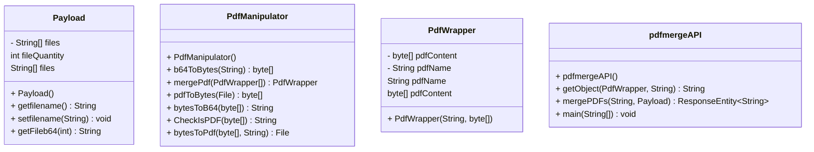

# pdf_merge_API

Il programma è un API che consente agli utenti di unire più file PDF in un unico documento, in fine verrà sfruttato l'API per la creazione di un custom connector per l'implementazione in un workflow su  Windows Power Automate 

# Operazioni

L'API è stata concepita per una sola operazione, ma la Classe Pdf_Manipulator contiene metodi attualmente inutilizzati, per implementazioni future.

## Unione di file PDF

L'endpoint "api/pdf/merge" rappresenta il punto di accesso da utilizzare per unire due o più file PDF. Per effettuare la l'operazione, è necessario inviare un [JSON in un formato specifico](#header-della-richiesta) come parte della richiesta. 

# Architettura

Il progetto è un'applicazione scritta in Java che utilizza Apache Maven per la gestione delle dipendenze. In particolare, Java Spring Boot è il framework utilizzato per la configurazione dell'endpoint. Inoltre, sono state utilizzate due librerie: Commons IO, per semplificare la conversione tra i file, e Apache PDFBox, per la manipolazione dei file PDF.


# Dipendenze

- Spring Boot: https://mvnrepository.com/artifact/org.springframework.boot/spring-boot-starter-web
- Apache PDFBox: https://mvnrepository.com/artifact/org.apache.pdfbox/pdfbox
- commons-io: https://mvnrepository.com/artifact/commons-io/commons-io


## Installazione

Per installare PDFMerge, scarica l'ultima [Release](https://github.com/Coco01010/perera-pdf-merger/releases/tag/pdf) del file JAR dell'applicazione. \
Oppure eseguire il comando Maven per compilare ed eseguire l'applicazione: `mvn spring-boot:run` 

La richiesta HTTP deve essere inviata a `http://<yourIP>:20801/api/pdf/merge`. 
Inoltre, è necessario includere un [payload JSON](#esempio-di-richiesta) e specificare l'[header](#header-della-richiesta) come indicato di seguito.


## API

### CLASSI
#### Payload
Metodi:

- getfilename() : restituisce il nome del file risultante dall'unione dei file PDF
- setfilename(String filename) : imposta il nome del file risultante - dall'unione dei file PDF
- getFileb64(int i) : restituisce il contenuto del file PDF in posizione i (in formato base64)
- getFileQuantity() : restituisce il numero di file presenti nell'array files
- setFiles(String[] files) : imposta l'array di file PDF da unire (in formato base64)

#### PdfManipulator
Metodi:

- bytesToB64(byte[] pdfContent) --> restituisce una stringa, prende in input un array di byte e restituisce la sua rappresentazione in formato base64 come stringa
- b64ToBytes(String base64String) --> restituisce un array di byte, prende in input una stringa in formato base64 e restituisce i corrispondenti byte
- mergePdf(PdfWrapper[] pdfwrapperArray) --> restituisce un oggetto di tipo PdfWrapper, prende in input un array di oggetti PdfWrapper che rappresentano i file PDF da unire e restituisce un nuovo PdfWrapper contenente il merge dei file
- CheckIsPDF(byte[] data) --> restituisce una stringa, prende in input un array di byte rappresentante un file PDF e verifica se il file è valido restituendo una stringa con lo stato della validità del file (ValidPdf, Unsupported PDF version, Invalid file header, argumentnull exception)

Metodi non utilizzati nel progetto:

- bytesToPdf(byte[] byteData, String destinationPath) --> restituisce un oggetto di tipo File, prende in input un array di byte e il percorso di destinazione su disco dove salvare il file in formato PDF
- pdfToBytes(File file) --> restituisce un array di byte, prende in input un oggetto di tipo File che rappresenta un file in formato PDF e restituisce i suoi byte

#### pdfmergeAPI

 Questa classe è l'api che permette l'unione dei file pdf validi.
 annotata con @SpringBootApplication, @RestController e @RequestMapping("/api/pdf") .

Parametri:

- api_key: String
- api_key_received: String
- request: Payload
- MergedPdf: PdfWrapper
- name: String

Metodi:

- main(): --> questo metodo è il punto di ingresso dell'applicazione e avvia l'esecuzione dell'API. Riceve in input gli eventuali argomenti da linea di comando e avvia il server sulla porta specificata.
- mergePDFs(String api_key_received, Payload request): ResponseEntity<String> -->  questo metodo gestisce la richiesta POST all'endpoint /api/pdf/merge. Riceve come parametri l'header API_KEY e il corpo della richiesta, rappresentato dall'oggetto Payload. Controlla la validità dell'API_KEY, la quantità di file richiesta e la validità dei singoli file in base al loro contenuto. Se tutto è corretto, richiama il metodo mergePdf() di PdfManipulator per unire i file e restituisce una risposta di successo con il pdf unito come corpo della risposta, altrimenti restituisce una risposta di errore con un messaggio appropriato.
- getObject(PdfWrapper MergedPdf, String name): String --> : questo metodo è utilizzato all'interno di mergePDFs() e si occupa di costruire il JSON di risposta a partire dal pdf unito. Riceve in input un oggetto PdfWrapper e il nome del pdf unito. Costruisce un oggetto di tipo HashMap, inserisce al suo interno il contenuto del pdf unito e il nome del pdf stesso e restituisce una stringa JSON rappresentante l'oggetto.

#### PdfWrapper

 Classe che rappresenta un file PDF, composto dal nome del file e dal contenuto in formato byte.

 Attributi:

- pdfName: String
- pdfContent: byte[]

- PdfWrapper(String pdfName, byte[] pdfBytes): Costruttore della classe che riceve come parametri il nome del file e il contenuto in formato byte e li assegna ai relativi attributi dell'istanza.
- getPdfContent(): Metodo che restituisce il contenuto del file PDF in formato byte. Restituisce una copia dell'array cosicché possa essere modificato senza intaccare l'array originale.
- getPdfName(): Metodo che restituisce il nome del file PDF.
- setPdfContent(byte[] givenContent): Metodo che imposta il contenuto del file PDF con quello ricevuto come parametro. Riceve il contenuto in formato byte e restituisce una copia dell'array cosicché possa essere modificato senza intaccare l'array originale.
- setPdfName(String pdfName): Metodo che imposta il nome del file PDF con quello ricevuto come parametro.

### Endpoint

### Richiesta

La richiesta deve contenere l'api-key nell'header, e il json deve contenere almeno 2 file pdf in formato base64 e il nome da dare al pdf in output.<br />
I formati pdf accettati vanno da versione 1.0 a 1.7 .<br />
Se la richiesta non dovesse essere conforme, il response conterrà una stringa con il tipo di errore oltre all' HTTP status.<br />

### Header della richiesta

```header
API_KEY: <api_key>
```

Momentanemente ho optato per una api-key costante.<br />
api_key = "ABC123".<br />

la label: API_KEY.<br />
la variabile: api_key_receiver.<br />


### Parametri della richiesta

| Nome  | Tipo | Descrizione |
| ------------- | ------------- | ------------- |
| `files`  | `String[]`  | Array di stringhe Base64 che rappresentano i PDF da unire |
| `pdfname`  | `String`  | Nome del file di output |

### Esempio di richiesta

```json
{
"filename": "pdfexample",
"files": [
            "File1": "JVBERi0xLjUKJcOkw7zDtsOfCjIgMCBv….",
            "File2": "JVBERi0xLjUKJcOkw7zDtsOfCjIgMCBv….",
            "FileN": "JVBERi0xLjUKJcOkw7zDtsOfCjIgMCBv…."
           ]
}
```

### Risposta

Se la richiesta ha successo, l'API restituirà il file PDF unito in formato base64 e il nome del pdf con estensione (utile in un workflow)\

### Parametri della risposta

| Nome  | Tipo | Descrizione |
| ------------- | ------------- | ------------- |
| `PdfContent`  | `String`  | Stringa base 64 del pdf risultante |
| `PdfName`  | `String`  | Nome del file di output |

### Esempio di risposta 

risposta andata a buon fine:
```json
{
    "PdfContent": "JVBERi0xLjQKJfbk/N8KMSAwIG9iago8PAovVH..",
    "PdfName":"pdfexample.pdf"
}
```

risposte di errore:
- Api-key scorretta o non presente
- quantità di file insufficente
- file invalido
- internal server error generico durante il merging

## UML class diagram



# Requisiti

## Information Hiding

  Un esempio di information hiding è rappresentato dall'utilizzo del modificatore di accesso private all'interno della classe PdfWrapper, che incapsula i dati sensibili dell'oggetto, ovvero il nome e il contenuto del PDF. Questi dati possono essere acceduti solo attraverso i metodi pubblici della classe(i getter e i setter), che controllano l'accesso ai dati e ne garantiscono la coerenza.

l'information hiding è presente anche nell'utilizzo del metodo b64ToBytes della classe PdfManipulator, che nasconde l'implementazione interna della conversione dal formato Base64 a byte array, proteggendo l'utente dalla complessità dell'algoritmo di conversione.


## Incapsulamento
L'incapsulamento è presente anche nella classe Payload, dove i dati sensibili, ovvero i nomi dei file e la loro quantità, vengono incapsulati e mantenuti privati e accessibili solo attraverso i metodi pubblici.

L'incapsulamento è presente ad esempio nell'utilizzo del metodo mergePDFs della classe pdfmergeAPI, che incapsula la logica di unione dei PDF all'interno della classe PdfManipulator, proteggendo l'utente dall'implementazione interna dell' unione e semplificando l'utilizzo dell'API.

## Ereditarietà

non è presente alcuna ereditarietà esplicita tra le classi del diagramma.
Ma ovviamente in modo implicito, tutte le classi del diagramma sono sottoclassi di Object, la classe di base di Java.

L'ereditarietà è presente anche nell'utilizzo delle classi delle librerie, come ad esempio nella classe ResponseEntity utilizzata dalla classe pdfmergeAPI, che eredita dalla classe HttpEntity e rappresenta una risposta HTTP con un corpo di tipo generico.

## Dipendenze

- Spring Boot:  per configurare un endpoint e l'api
- Apache PDFBox: libreria per effettuare operazioni sui pdf
- commons-io: libreria per facilitare le conversioni tra formati di files


## Power automate custom connector

Questo custome connector è un esempio di come è possibile usare l'API , in questo caso per una sua combinazione con altri servizi in un workflow di Power automate

```json
{
  "swagger": "2.0",
  "info": {
    "title": "PdfMergerapi",
    "description": "custom connector che usa un API per il merge di due o più pdf",
    "version": "1.0"
  },
  "host": "37.77.121.227:20801",
  "basePath": "/api/pdf/merge",
  "schemes": [
    "http"
  ],
  "consumes": [],
  "produces": [],
  "paths": {
    "/": {
      "post": {
        "responses": {
          "default": {
            "description": "default",
            "schema": {
              "type": "object",
              "properties": {
                "PdfContent": {
                  "type": "string",
                  "description": "PdfContent"
                },
                "PdfName": {
                  "type": "string",
                  "description": "PdfName"
                }
              }
            }
          }
        },
        "summary": "merge dei pdf",
        "description": "merge dei pdf in ordine di inserimento nel json",
        "operationId": "1234",
        "parameters": [
          {
            "name": "API_KEY",
            "in": "header",
            "required": true,
            "type": "string"
          },
          {
            "name": "body",
            "in": "body",
            "required": false,
            "schema": {
              "type": "object",
              "properties": {
                "filename": {
                  "type": "string",
                  "description": "filename"
                },
                "files": {
                  "type": "array",
                  "items": {
                    "type": "string"
                  },
                  "description": "files"
                }
              }
            }
          }
        ]
      }
    },
    "/api/pdf/merge": {}
  },
  "definitions": {},
  "parameters": {},
  "responses": {},
  "securityDefinitions": {
    "api_key": {
      "type": "apiKey",
      "in": "header",
      "name": "api_key_receiver"
    }
  },
  "security": [],
  "tags": []
}
```
